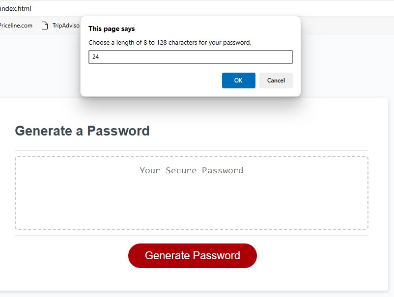
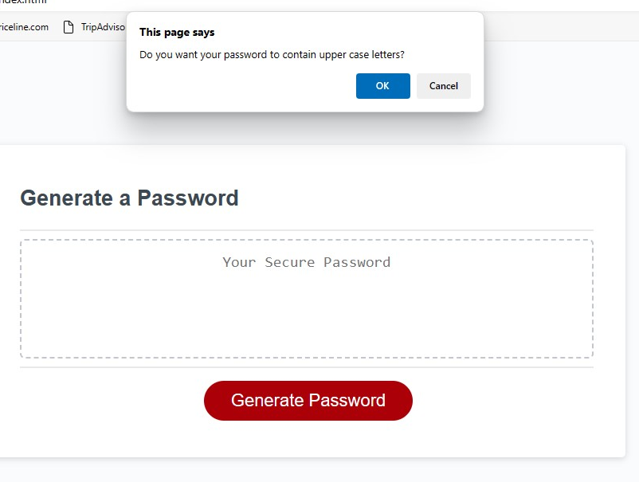
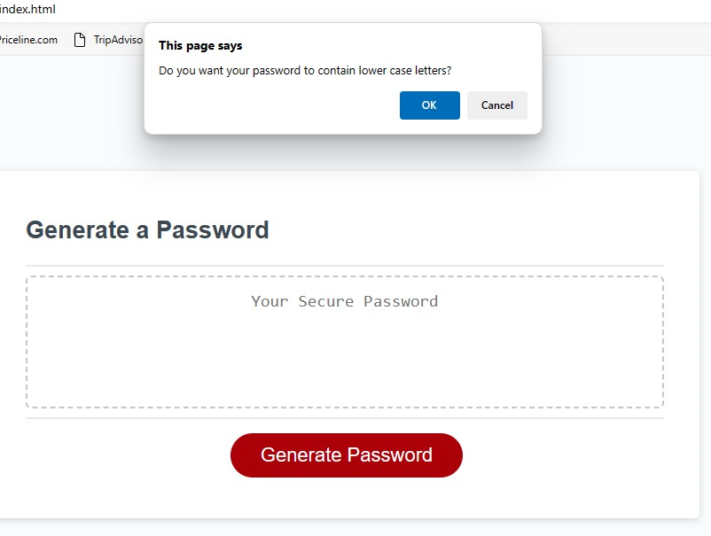
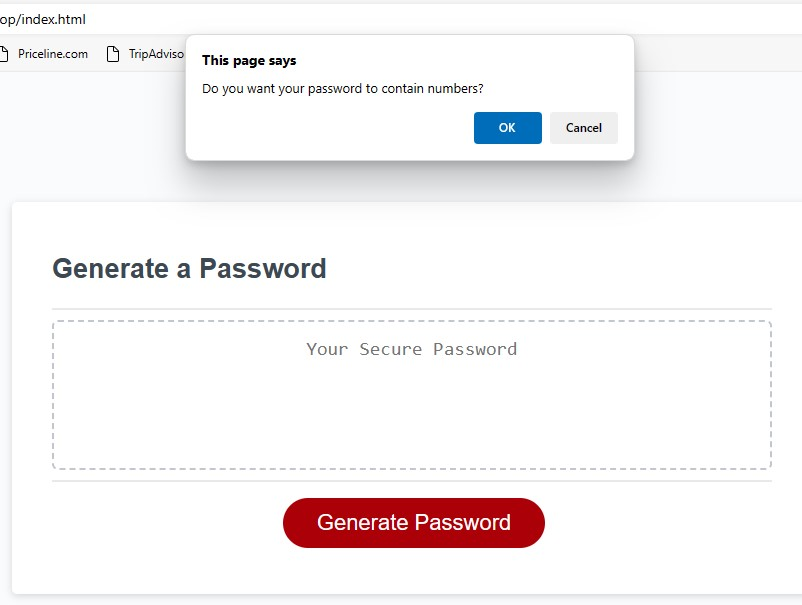
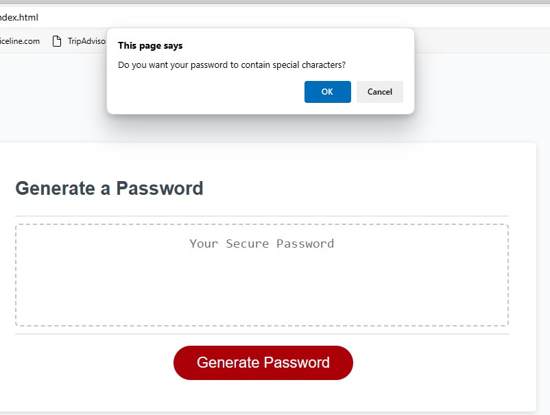
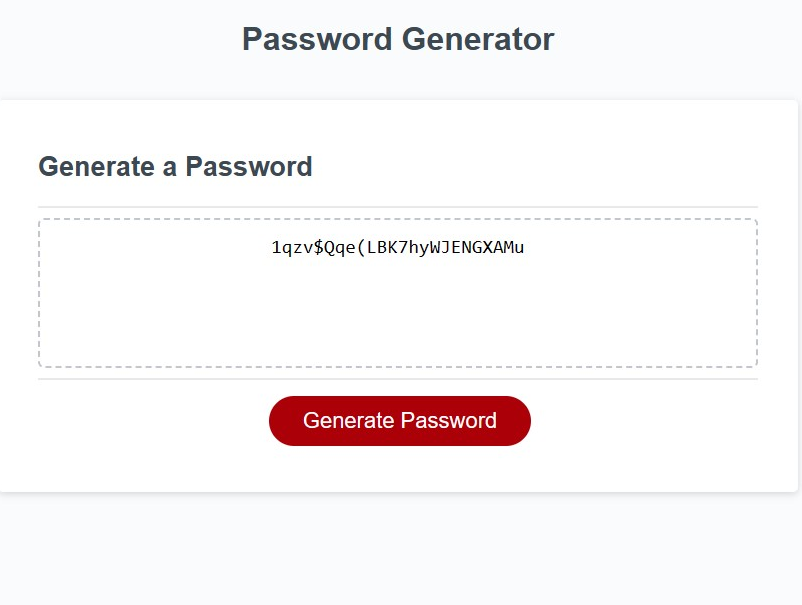

# Writing a Function to Randomly Generate a Secure Password

## Description

I undertook this project to learn how to write a function that could generate a random password using an assortment of characters to make it more secure. This allowed me to put into practice everything that I have learned so far in JavaScript and to look up a few things I haven't learned yet. This project required me to utilize plenty of for loops, methods, relational operators, and functions within functions to achieve the desired result. The end result is a website where a user can generate a password by selecting length, and whether to include upper case and/or lower case letters, numbers and special characters. The function includes another set of if statements and for loops that verify that the final password does in fact include each of the character types the user has selected, guaranteeing that it will meet the user parameters and desired security level.

## Usage

The web application is located [here](https://distractabee.github.io/js-challenge/)

Usage is straightforward. When a user clicks on the "Generate Password" button, they will be given a prompt asking how many characters long the password should be. Then there are four Y/N confirmation messages that ask if the user would like to include or not upper case letters, lower case letters, numbers and special characters. They may click yes or no as desired, and at the end the password will be generated in the text field about the button.

## Credits

Sections of the JavaScript code between lines 14-56 were written by my instructor [Jon Lynch](https://github.com/jonnylynchy) in a livecoding session.
Daniel DeRusha (no GitHub account) provided troubleshooting and debugging help.
[Alex Kaye](https://github.com/akayer19) helped with the syntax on the for loops after line 63.

## License

MIT License (c) 2023 Jessica Jones